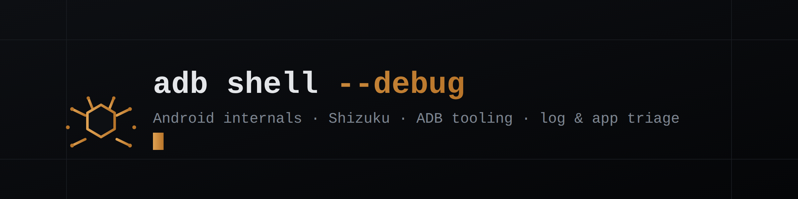

 

**Android power user, 10+ years in — now focused on testing and debugging apps at the ADB shell / Shizuku level.**

I poke at how Android apps actually behave once you're past the UI: permissions, system settings, logs, and the privileged-but-rootless access ADB and Shizuku give you. I code sometimes, mostly to build small tools that make that process faster.

---

### about

- Testing and triaging Android apps, mostly through **ADB shell** and **Shizuku**
- Writing small scripts/tools when an existing one doesn't do what I need
- Contributing where I can to open-source Android tooling — even small fixes count
- Still learning; this is a hobby that occasionally turns into something useful for others

### tools

`ADB` · `Shizuku` · `Termux` · `Python` · `Kotlin` · `Git`

### projects

*(added as they're ready — nothing pinned here yet on purpose, rather than placeholder links)*

### contact

- Email — **prlvshell@proton.me**
- Telegram — **[@prlvshell](https://t.me/prlvshell)**
- Discord — **@privshell**
- Twitter/X — **[@prlvshell](https://twitter.com/prlvshell)**
- Support — *(link coming soon)*
